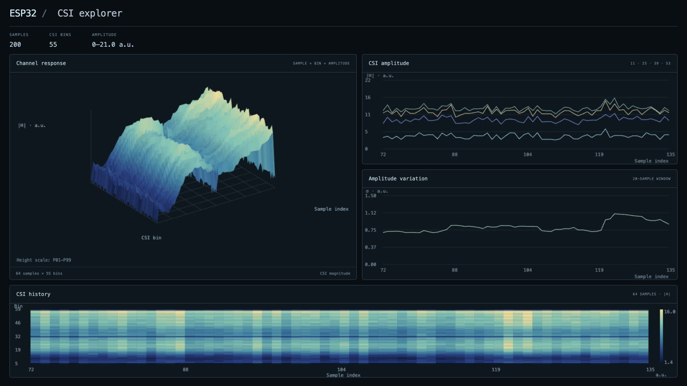

# ESP32 CSI Explorer

Connect an ESP32-C3 receiver over USB and inspect the Wi-Fi channel measurements
it sends: amplitude traces, a CSI heatmap and a 3D bin × sample × magnitude surface.
This is a local hardware project with pinned transmitter/receiver firmware and a
browser client. It starts with empty plots until measurements arrive.

**[Open the explorer](https://codingard.github.io/esp32-csi-explorer/)** ·
**[Watch the recorded-data demo](https://codingard.github.io/esp32-csi-explorer/?demo=walking)**

The hosted explorer works immediately, without installing Node.js. Use desktop
Chrome or Edge for USB input, or open the demo link to explore published recordings.



*Actual interface with attributed recorded data loaded, shown in Present mode.
The hardware view starts empty until a receiver is connected.*

[Hardware and wiring](docs/HARDWARE.md) · [Pinned firmware](docs/FIRMWARE.md) ·
[Physical acceptance](docs/TESTING.md) · [File format](docs/FILE_FORMAT.md)

## Hardware

- Two **ESP32-C3-DevKitM-1** boards: one transmitter, one receiver.
- Two USB data cables and a computer running desktop Chrome or Edge.
- Board antennas, fixed placement and more than 1 m between the boards as an
  upstream starting arrangement. No extra sensor, DAC or camera is required.

[Parts list](docs/bom.csv) and [connection diagram](docs/setup.svg). Device spacing
is an experiment setting, not a range or reconstruction-accuracy guarantee.

## Build, connect and receive

1. Install **ESP-IDF 6.0.2** and fetch the pinned source:

   ```sh
   npm run firmware:fetch
   ```

2. Build and flash `csi_send` on the TX board and `csi_recv` on the RX board,
   following the exact paths, chip target and ports in [FIRMWARE.md](docs/FIRMWARE.md).
   Flashing replaces the program already stored on each selected board.
3. Close the receiver serial monitor. Start this project with **Node.js 20+**:

   ```sh
   npm start
   ```

4. Open **http://127.0.0.1:4175/** in desktop Chrome/Edge. Click **Connect USB** and
   choose the receiver's USB-UART port. The browser opens it at **921600 baud**.
   Port access is read-only: this client does not flash, change radio settings,
   toggle serial control signals or write firmware commands.
5. **Waiting for CSI** means the port opened; **Receiving CSI** appears only after
   a valid packet. The header counts accepted/rejected packets. **No recent CSI**
   appears after a three-second gap; the graph receives no invented replacement.
6. Select bins, a display window and surface/points mode. **Freeze view** freezes
   display only; the receiver still fills a bounded 512-packet buffer. Disconnect
   releases the port. Device unplug/error recovery is handled by the client.
7. **Save CSV** exports the latest retained raw CSI rows with their header and
   metadata. **Save session** exports magnitudes and source metadata as JSON.
   These are bounded snapshots, not a promise to retain an entire long experiment.

The firmware keeps upstream radio/UART defaults, with pinned dependencies and a
documented IDF 6 bandwidth-enum compatibility patch. If the received transmitter or PHY
layout changes, incompatible rows are rejected; reconnect to start a new session.
The app deliberately does not stitch unrelated radio layouts into one surface.

## Files and demonstration data

**Open file** accepts magnitude CSV, stock Espressif CSI CSV and compatible JSON.
**Open sample data** explicitly loads three attributed published buffers. File
viewing is available in other modern browsers even when Web Serial is unavailable.
Source mode remains available in the normal interface and expandable details.

File controls include play/pause, per-sample seek, display speed and looping.
**Focus view** expands the plots. **Present** hides controls, session selection and
playback transport for screen recording; press **Escape** to return. It works
with either the hardware stream or an opened file. The source and data are
unchanged. There is no separate movie generator in the application. The accompanying video captures
this actual interface with a published walking buffer loaded. Its 5 samples/s
display speed and 64-sample window are presentation settings, not a claim about
acquisition timing or a physical capture made here. The video delivery includes a
separate credits file; provenance is recorded in [METHOD.md](METHOD.md).

## What the graphs mean

CSI is a set of channel measurements. The 3D surface axes are **stored CSI bin,
sample index and magnitude**, not room coordinates. The variation panel is the
mean per-bin standard deviation over 20 received samples. It is not a trained
activity classifier, probability, person counter or body reconstruction.

Live input always drops the first two complex slots conservatively and retains
zero-valued bins for a stable layout. Magnitudes use the components reported by
the firmware; the pinned upstream receiver applies gain compensation. This client
does not add calibration. Raw CSI file imports use the same bin policy.
Per-window color/height scaling clips P01–P99 extremes; traces keep the full range.
No samples are created to fill packet gaps. Device timestamps are retained as
raw counters, while axes use sample indices. See [method](METHOD.md).

## Reproducibility and licenses

Firmware: **Espressif ESP-CSI**, revision
`8633d67152db2808f141cc1595970aa9cf406045`, Apache-2.0 with original notices.
The fetcher checks the archive hash, retains upstream source/license files and
pins SDK/component versions. It refuses to overwrite a changed checkout. Exact
pins and local manifest changes are in [firmware/manifest.json](firmware/manifest.json).
It does not build or flash automatically.

Original browser code is MIT licensed. Bundled data is by
[Mohammed-Baqir / RF_ESP32_Dataset](https://github.com/Mohammed-Baqir/RF_ESP32_Dataset),
**CC BY 4.0**; it was not collected by ardchain. Original arrays, source revision,
hashes and conversion are retained in [data/ATTRIBUTION.md](data/ATTRIBUTION.md).

No build step, npm packages, analytics, upload service or external scripts are
required to run the browser client. The local server exposes a fixed list of app
and documentation files; Git internals, source checkouts and captures are not served.

## Verification

```sh
npm run check
python3 scripts/fetch_firmware.py --verify
npm run package
```

Automated checks cover CSI formats, signed components, fragment boundaries,
corrupt lines, cancellation, unplug/stream errors, bounded retention and file
round-trips. **Physical USB/RF acceptance remains pending**; unit tests and firmware
builds are not bench measurements. Both pinned firmware examples compile for
ESP32-C3 with ESP-IDF 6.0.2; see [testing status](docs/TESTING.md).

The source release contains the application, firmware fetcher, pinned configuration,
English build guides, tests and attributed example data. Video exports and historical
prototypes are excluded.

The initial release is organized into implementation snapshots; see
[history metadata](docs/HISTORY.md) for how their dates are assigned.
