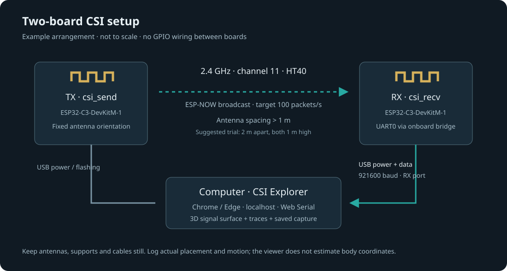

# Build a two-board CSI capture setup

The reference build uses **two ESP32-C3-DevKitM-1 boards**, their onboard
USB-to-UART bridges and Espressif's pinned `csi_send` / `csi_recv` examples.
No router, camera, DAC, jumper wiring or cloud account is needed for this path.
This is a channel-measurement viewer: it does not recover a body or room position.

## Parts and connections

| Quantity | Part | Purpose |
| --- | --- | --- |
| 2 | ESP32-C3-DevKitM-1 with ESP32-C3-MINI-1 PCB antenna | One transmitter, one receiver |
| 2 | USB data cables matching the boards' Micro-B connectors | Flash both boards; power TX; receive data from RX |
| 1 | Computer with two USB ports or a powered hub | Build firmware and open the viewer |
| 2 | Stable nonmetal supports | Keep antenna locations/orientations fixed |

Machine-readable list: [bom.csv](bom.csv). The official board's Micro-USB port
connects to its USB-UART bridge, not the C3 native USB pins. The stock receiver
prints on **UART0, GPIO21 TX / GPIO20 RX, 921600 baud** through that bridge.
These pins are already connected on this board. Do not add wires between TX and RX
boards. USB provides power; Wi-Fi carries the measurement packets.
The transmitter's console is normally 115200 baud; its flash baud is independent.
[Official board reference](https://docs.espressif.com/projects/esp-dev-kits/en/latest/esp32c3/esp32-c3-devkitm-1/user_guide.html).

Other C3 boards may route their USB port directly to native USB instead. They are
not interchangeable with this wiring assumption: check their schematic and console
configuration. C5/C6 and router modes are outside this reference build.

## Place the boards

Start with clear space and **more than 1 m between antenna locations**, following
[Espressif's guidance](https://github.com/espressif/esp-csi/blob/8633d67152db2808f141cc1595970aa9cf406045/examples/get-started/README.md).
An example trial can use 2 m spacing, both supports 1 m high, both boards upright
with their antenna ends at the top. These are suggested trial settings, not
measured geometry from the bundled dataset or a guarantee of detection range.
Keep the boards and cables stationary, with antennas clear of nearby metal.
The drawing shows connections, not a sensing beam or a field-of-view boundary.

Document your actual room and board coordinates, antenna orientations, firmware
revision, channel, furniture and the motion you perform. Start with 30 seconds of
a quiet room, then walk across the space between the fixed boards; repeat the same
movement several times. Reflections, receiver gain and unrelated movement can all
change amplitude. A waveform change alone does not identify its cause.

## Build, connect, capture

1. Follow [FIRMWARE.md](FIRMWARE.md) to fetch the exact source and build/flash each
   board. Label them **TX** and **RX**, and identify their serial ports separately.
2. Power TX, then RX. Close ESP-IDF's serial monitor and any other app holding RX.
3. Start this project's local server and open it in desktop Chrome or Edge at
   `http://127.0.0.1:4175/`. Web Serial requires a supported browser and a secure
   context; loopback HTTP is accepted. File import remains available elsewhere.
4. Click **Connect USB** and choose the **receiver** at **921600 baud**.
   The browser requests access to the port you select. It reads firmware output;
   it does not flash the board or send tuning commands.
5. The pinned 25-column format is recognized even if its header was printed
   before connection. Boot diagnostics are ignored; complete validated
   `CSI_DATA` rows feed the plots. If none arrive, check TX power, the selected
   RX port and matching firmware settings.
6. Check the accepted/rejected counts, capture a trial, then save the capture
   before leaving the page. Keep experiment notes beside the exported file.
   Reopen the file to inspect it using the same plots.

The sender targets 100 transmissions/s; that is not a guaranteed received packet
rate. CSV serialization, RF loss and host processing can lower the rate. Missing
packets must remain missing. A line index is not elapsed time.

## What reaches the plots

The pinned C3 receiver prints signed component pairs in imaginary/real order.
It applies Espressif's gain compensation before printing, so these values can
exceed the signed 8-bit range. The viewer converts pairs to magnitudes and
conservatively omits the first two complex slots. It does not undo that firmware
gain correction, calibrate magnitude into dBm, interpolate missing packets or
infer poses. Live input preserves a fixed slot layout, including all-zero slots;
this prevents columns changing meaning while a capture runs.

The bundled example sessions came from a different AP-to-ESP32 experiment.
They demonstrate the interface, not a recording of these two C3 boards. Their
attribution and measurement limits remain in [data/ATTRIBUTION.md](../data/ATTRIBUTION.md).
Use [TESTING.md](TESTING.md) to record your own physical acceptance results.
